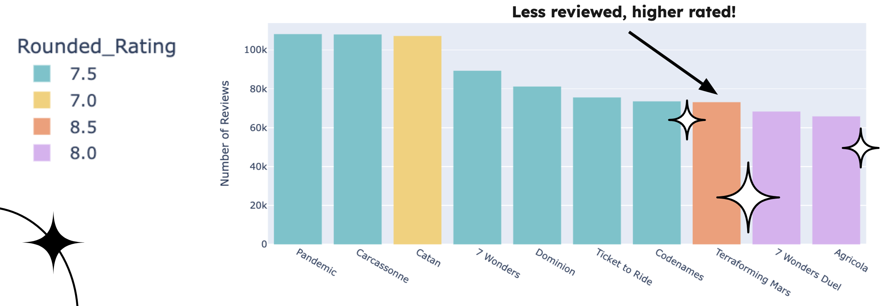
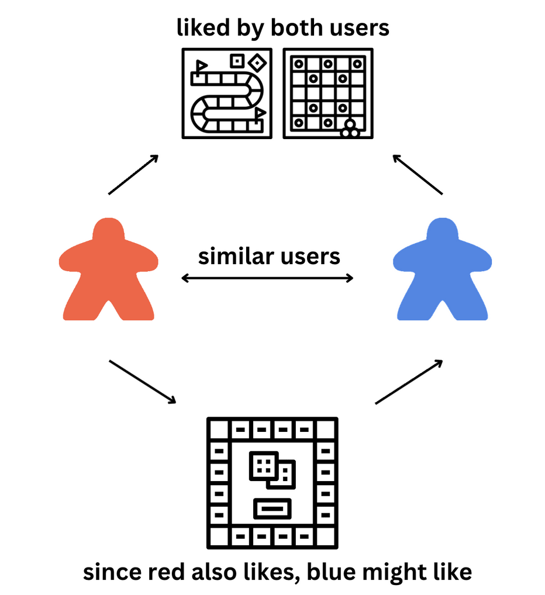
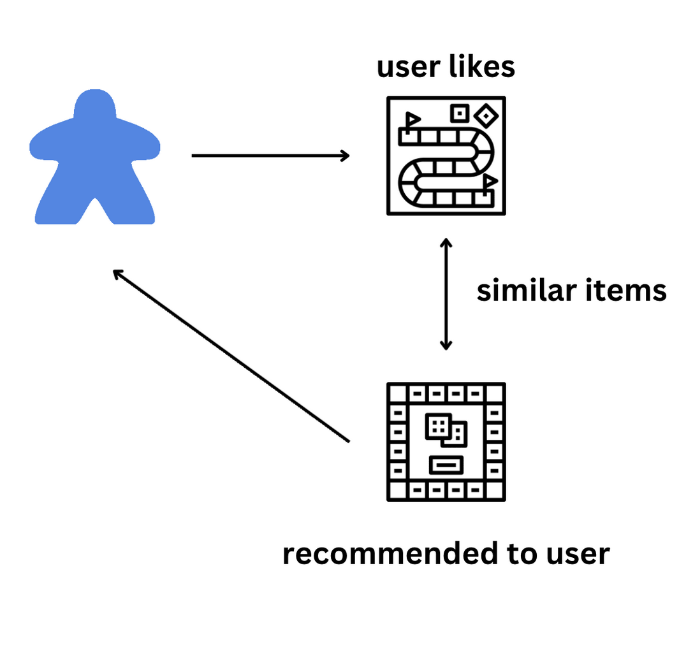

# Meeple Matchmaker
## A board game recommendation system! 


# The Goal
Provide a hybrid recommendation system that using both **collaborative** and **content-based** recommendations for individual users and groups of users to find the ideal game to play during board game night. 

# The Data 

[BoardGameGeek](https://boardgamegeek.com/) (BGG) is a game database with over 125,600 different tabletop games, including European-style board games, wargames, and card games. In addition to the game database, the site allows users to rate games on a 1–10 scale and publishes a ranked list of board games, as rated by the users. 

The dataset being used for this project is from [kaggle](https://www.kaggle.com/datasets/threnjen/board-games-database-from-boardgamegeek), sourced from the BGG API. 



Games with a lot of reviews were not necessarily the most popular! Explore more [here](Appendices/EDA.ipynb) 

 Key Features of the Data
- Highest Rated
- Average Ratings per Game 
- Common Themes / Mechanics
- Unique User Reviews

Strengths:
- Wide variety of games & features 

Limitations: 
- The game descriptions have been pre-processed in a way that has left a lot of bogus words (ie 'aaa' and 'publisherfollowe') in the corpus. 
- VERY wide (over 300 features total per game)
- Analysis from 1960 to 2021
- Analysis of users had to be limited due to RAM Constraints (too many!!!) 

# The Process 
### Collaborative Filtering


**Collaborative filtering** is a recommendation technique that suggests items to users based on the attributes of the items and the user's past preferences. I used SVD (Singular Value Decomposition) from the [surprise](https://surpriselib.com/) library for my collaborative model. 

The goal of an SVD-based recommendation system is to predict what a user will like based on patterns of preferences from other users. It uses past data of user-item interactions, like our game ratings, to make these predictions.

#### How It Works
User-Item Matrix: We have a matrix where rows represent users, and columns represent board games. Each cell in the table shows how much a user has rated a game, on the scale of 1-10. 

| User  | CATAN | Ticket To Ride | Monopoly | Coup | 
| ----- | -------- | ----- | -------- | -------- |
| me | ? | 8 | 1 | 10 | 
| myself | 10 | ? | 1 | ? | 
| I | 8 | 5 | 3 | ? | 

**User-Interaction Matrix** Question Marks represent unknown values we want to predict. 

SVD breaks down this large matrix into three smaller matrices (the 'Decomposition'):

    - U (User matrix): Describes each user in terms of their preferences for various "latent factors" (hidden patterns or features that influence preferences).
    - Σ (Sigma matrix): Contains singular values, which are a measure of the importance of each latent factor.
    - V (Item matrix): Describes each item in terms of those same latent factors.

These three matrices together represent the original matrix in a compact form.

To predict a missing value (like the "?" for 'me' and CATAN), the system combines the corresponding values from the U, Σ, and V matrices. This predicted value tells how much one user might like that cell's game based on their ratings for other games.

After filling in all the missing values, the system can recommend items that a user is predicted to like the most. Basically, if we predict a user would rate something as a 10, we recomend it to them! 

### Content-Based Filtering 


Content-Based Filtering focuses on how similar ite

I experimented with both  **Jaccard Similarity** and **Cosine distance** for comparing item similarity using themes and mechanics, and after testing, decided to use **cosine distance** for the final system. 

#### Jaccard Similarity

The Jaccard Similarity measures the similarity between two sets by comparing the number of common elements they share relative to the total number of unique elements across both sets.

The Jaccard similarity looks at how many items the two users have in common versus how many total distinct items they have liked between them. The more overlap, the higher the similarity.

#### Cosine Similarity 

Each user is represented as a vector where each element corresponds to how much the user likes (or interacts with) a particular item (in our case, it represents how often they rate games with specific themes and mechanics) 

The cosine similarity calculates the cosine of the angle between these vectors. If two vectors point in the same or similar direction (small angle), it means the users are similar. If they point in opposite directions (large angle), they are very different.

# Hybrid function: Combine collaborative and content-based scores

The Alpha represents the 'Weight' of the collaborative score. 

```
score = alpha * collaborative_score + (1 - alpha) * content_based_score
```

# The Results 


RMSE is a way to measure how far off the recommendations system’s predictions  are from actual ratings that users gave. 

My Hybrid system's RMSE was 1.05, which means that on average, the hybrid system's recommendations are about 1.05 points away from the actual ratings given by users.


# Appendices 
## [EDA](Appendices/EDA.ipynb) 
Dove deeper into the different features 

View [here](Appendices/EDA.ipynb)

## [K-NN](Appendices/KNN-and-Pyspark.ipynb)
K-Nearest Neighbors (KNN) is a machine learning algorithm used for classification and regression, which makes predictions based on the closest training examples in the feature space. In classification, KNN assigns a class to a data point by finding the "K" nearest points and choosing the most frequent class among them, while in regression, it predicts the average of the values of the K nearest neighbors

Created neighbors for predictions [here](Appendices/KNN-and-Pyspark.ipynb)

## [NLP](Appendices/NLP.ipynb) 
Natural Language Processing (NLP) for classification involves using algorithms to automatically analyze and categorize text data into predefined categories or labels. This typically involves preprocessing text (e.g., tokenization, stemming, removing stop words), converting it into numerical representations (such as TF-IDF, word embeddings, or bag-of-words), and then training a machine learning model (like Naive Bayes, SVM, or deep learning models) to predict the category of a given text based on its content. 

Attempted to categorize similar games [here](Appendices/NLP.ipynb) 

## [Hybrid](Appendices/Hybrid.ipynb) 
A shortcut to the hybrid system. 

Attempted to categorize similar games [here](Appendices/Hybrid.ipynb) 


